# 🚌 Bus Pass Management System


A web-based **Bus Pass Management System** developed using **PHP, MySQL, HTML5, CSS3, Bootstrap, and JavaScript**. The application digitizes the traditional bus pass process by allowing users to apply for bus passes, renew them, make online payments, track application status, and download digital bus passes. Administrators can efficiently manage users, applications, payments, and reports through an administrative dashboard.

> 🎓 Developed as an **BCA Final Year Project**.

---

# 📖 Project Overview

The Bus Pass Management System is designed to automate the bus pass application process for students and working professionals. It eliminates paperwork by providing an online platform where users can register, apply for new bus passes, renew existing passes, make payments, and download digital passes. The system also enables administrators to manage applications, users, payments, and generate reports efficiently.

---

# ✨ Features

## 👤 User Features

- User Registration & Login
- Forgot Password & Password Reset
- Apply for New Bus Pass
- Renew Existing Bus Pass
- Track Application Status
- Online Payment Module
- Download Bus Pass (PDF)
- View Bus Pass Details
- Update User Profile
- Contact Support
- Submit Feedback
- Responsive User Dashboard

---

## 👨‍💼 Admin Features

- Secure Admin Login
- Admin Dashboard
- Manage Users
- Manage Bus Pass Applications
- Approve / Reject Applications
- Manage Bus Pass Records
- View Payment Details
- View Contact Messages
- View User Feedback
- Generate User Reports

---

# 🛠 Tech Stack

## Frontend

- HTML5
- CSS3
- Bootstrap 5
- JavaScript

## Backend

- PHP

## Database

- MySQL

## Libraries Used

- PHPMailer
- TCPDF
- FPDF

## Server

- XAMPP (Apache + MySQL)

---

# 📂 Project Structure

```text
bus_pass_system/
│
├── admin/
├── uploads/
├── PHPMailer/
├── tcpdf/
├── fpdf/
├── screenshots/
├── config.php
├── index.php
├── login.php
├── register.php
├── dashboard.php
├── bus_pass_management.sql
├── README.md
└── .gitignore
```

---

# 🚀 Installation Guide

## 1. Clone Repository

```bash
git clone https://github.com/TanviShevade/bus-pass-management-system.git

cd bus-pass-management-system
```

---

## 2. Move Project

Copy the project folder into:

```text
xampp/htdocs/
```

---

## 3. Create Database

Open **phpMyAdmin** and create a database named:

```sql
bus_pass_management
```

---

## 4. Import Database

Import:

```text
bus_pass_management.sql
```

---

## 5. Configure Database

Open:

```text
config.php
```

Update your database credentials if necessary:

```php
$host = "localhost";
$user = "root";
$password = "";
$database = "bus_pass_management";
```

---

## 6. Start XAMPP

Start:

- Apache
- MySQL

---

## 7. Run the Project

User Panel

```text
http://localhost/bus_pass_system/
```

Admin Panel

```text
http://localhost/bus_pass_system/admin/admin_login.php
```

---

# 📸 Project Screenshots

## 🏠 Home Page


---

## 🏠 Home Page (Alternative View)


---

## 📝 User Registration

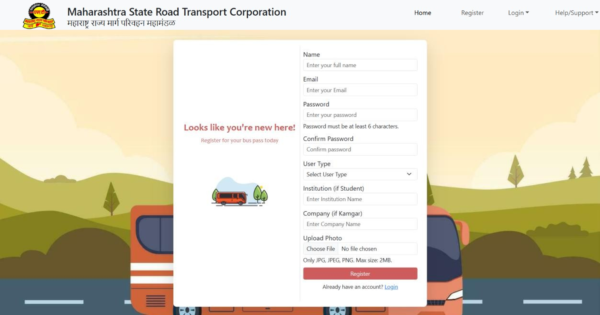

---

## 📝 Registration Form


---

## 🔐 User Login

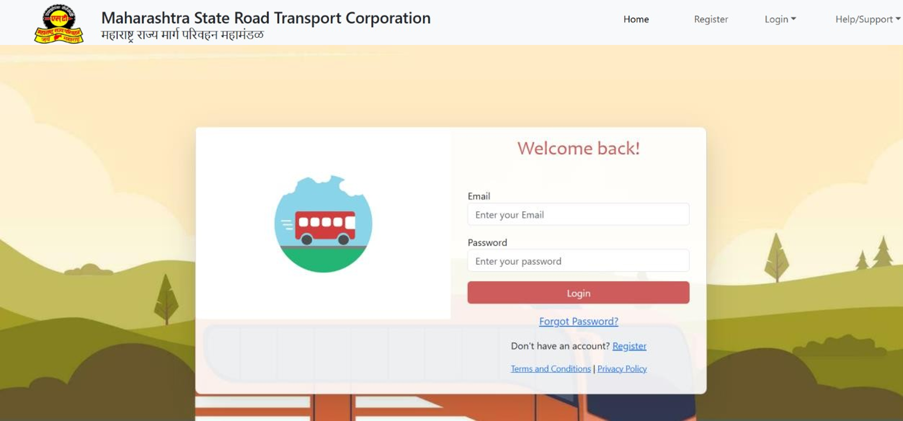

---

## 🔑 Forgot Password

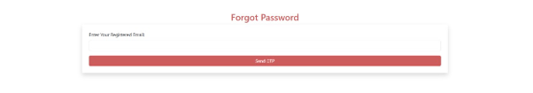

---

## 🔄 Reset Password

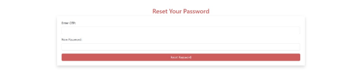

---

## 👤 User Dashboard

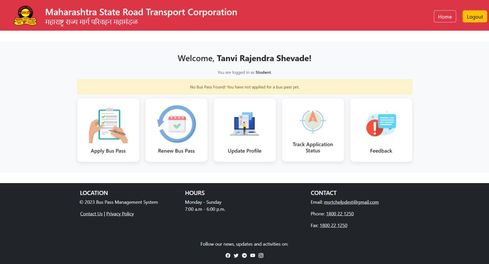

---

## 🚌 Apply for Bus Pass

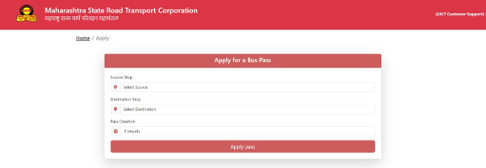

---

## 💳 Payment Form

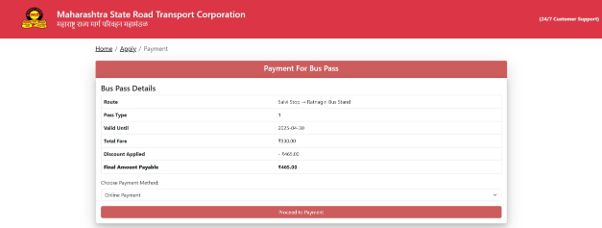

---

## 🎫 View Bus Pass

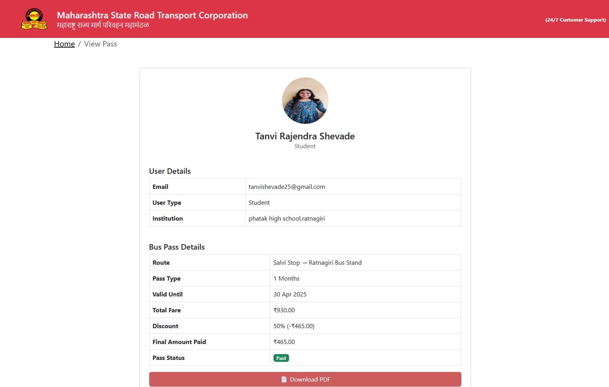

---

## 📄 Download Bus Pass (PDF)

.png)

---

## 🔄 Renew Bus Pass

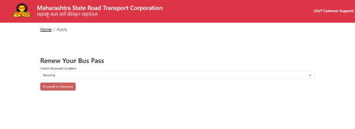

---

## 📍 Track Application Status

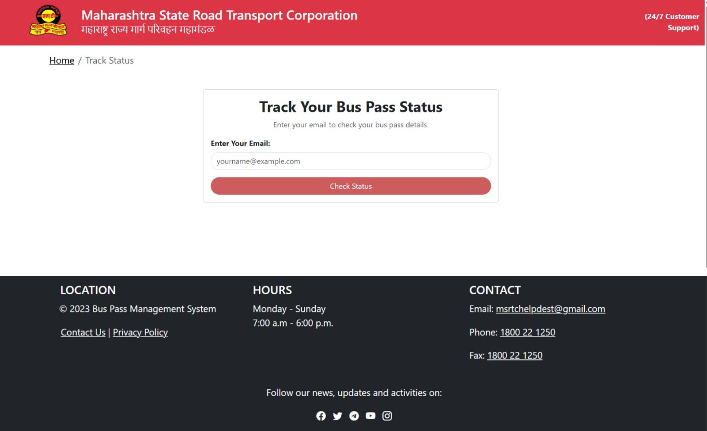

---

## 👤 Update Profile

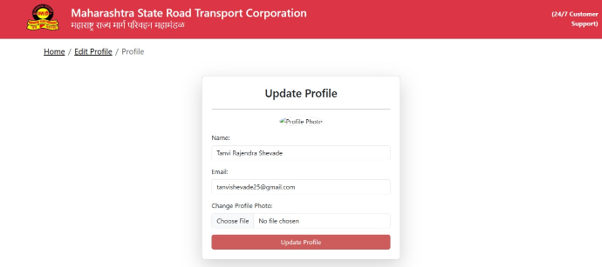

---

## 📞 Contact Us

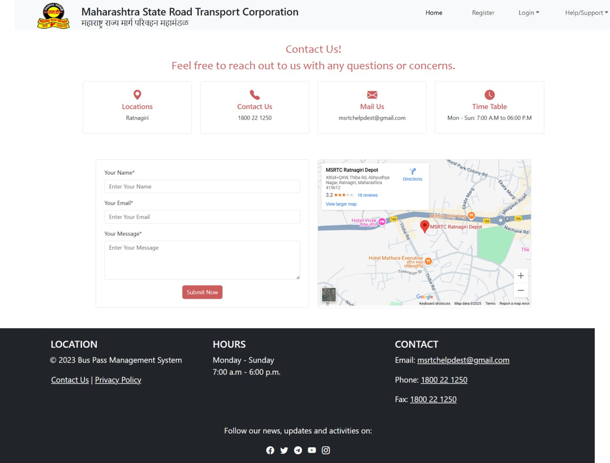

---

## ❓ FAQs

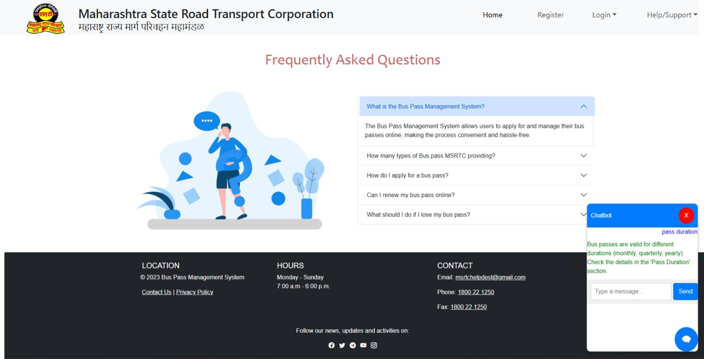

---

## 💬 Feedback Form

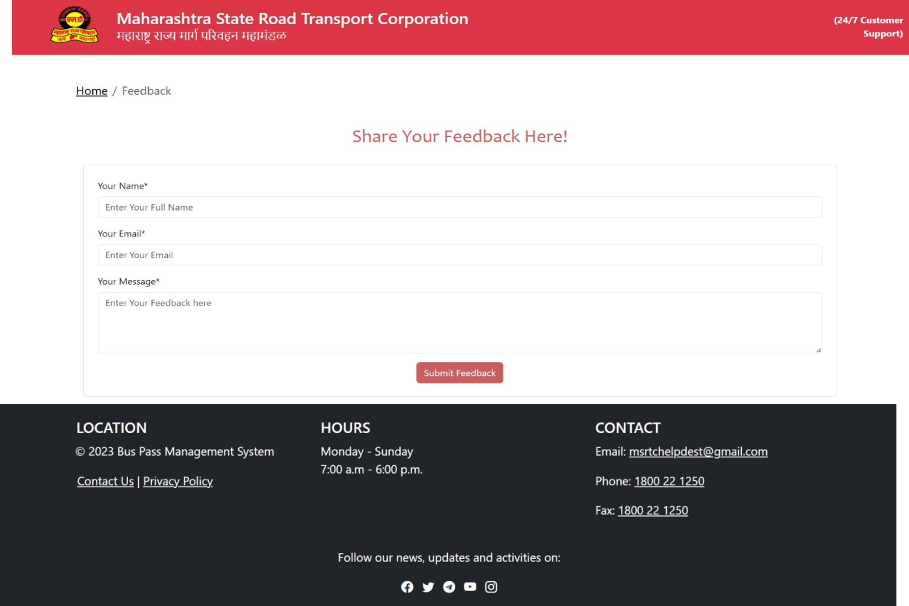

---

# 👨‍💼 Admin Screens

## 🔐 Admin Login

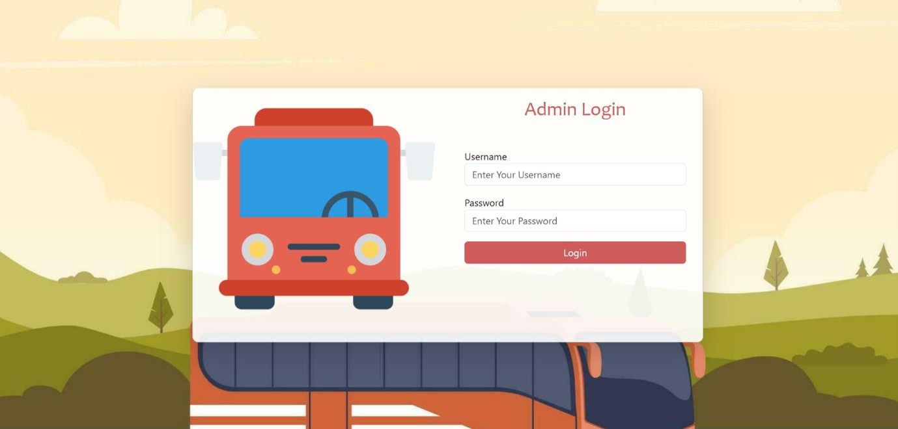

---

## 📊 Admin Dashboard

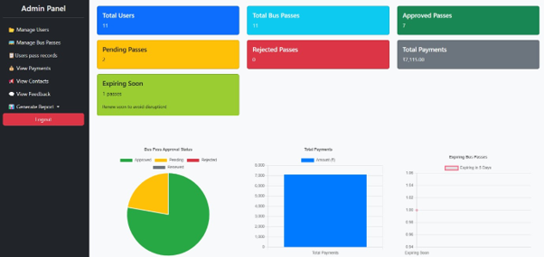

---

## 👥 Manage Users

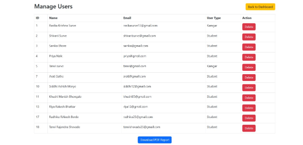

---

## 🚌 Manage Bus Pass

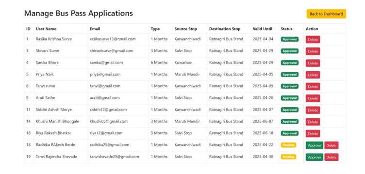

---

## 📋 Manage Bus Pass Records

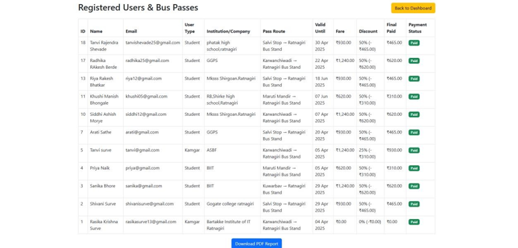

---

## 💳 View Payments

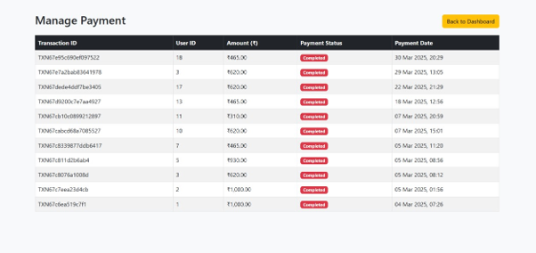

---

## 📞 View Contact Messages

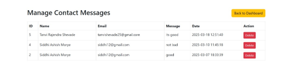

---

## 💬 View Feedback

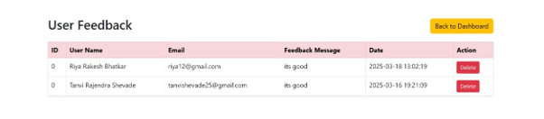

---

## 📈 User Report

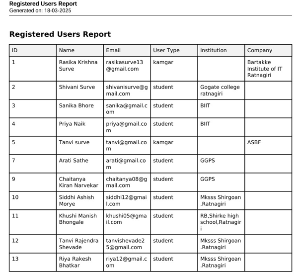

---

# ✨ Key Functionalities

- Secure User Authentication
- Online Bus Pass Application
- Bus Pass Renewal
- Online Payment System
- PDF Bus Pass Generation
- Email Notifications
- Pass Status Tracking
- User Profile Management
- Contact & Feedback Module
- Admin Dashboard
- Report Generation

---

# 🔮 Future Enhancements

- QR Code Verification
- Razorpay Payment Gateway
- SMS Notifications
- Email Reminder for Pass Expiry
- Mobile Application
- Multi-language Support
- AI Chatbot Support
- Advanced Analytics Dashboard

---

# 🏛 System Architecture

```text
User
   │
   ▼
Browser
   │
   ▼
PHP Application
   │
   ▼
MySQL Database
```

---

# 👩‍💻 Developer

**Tanvi Shevade**

🎓 MCA Student

💻 Aspiring Full Stack Developer

### Connect with Me

- **GitHub:** https://github.com/TanviShevade
- **LinkedIn:** https://www.linkedin.com/in/tanvi-shevade-aabbb6280

---

# ⭐ Support

If you found this project helpful, please consider giving it a ⭐ on GitHub.

---

# 📄 License

This project was developed as an **BCA Final Year Project** 
